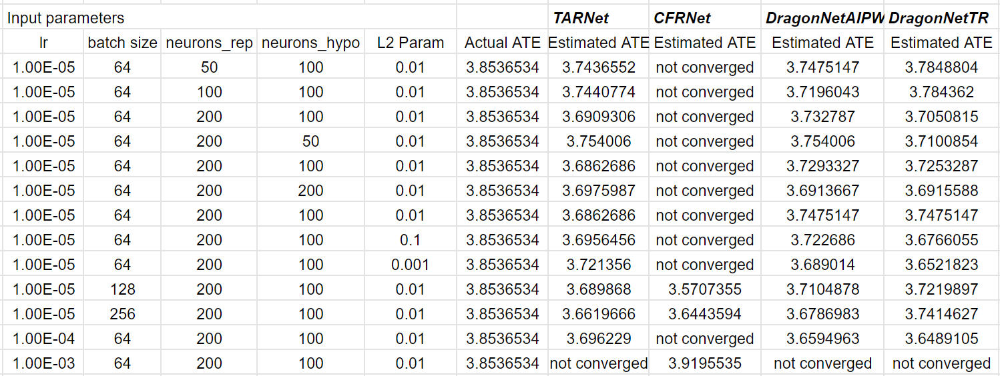
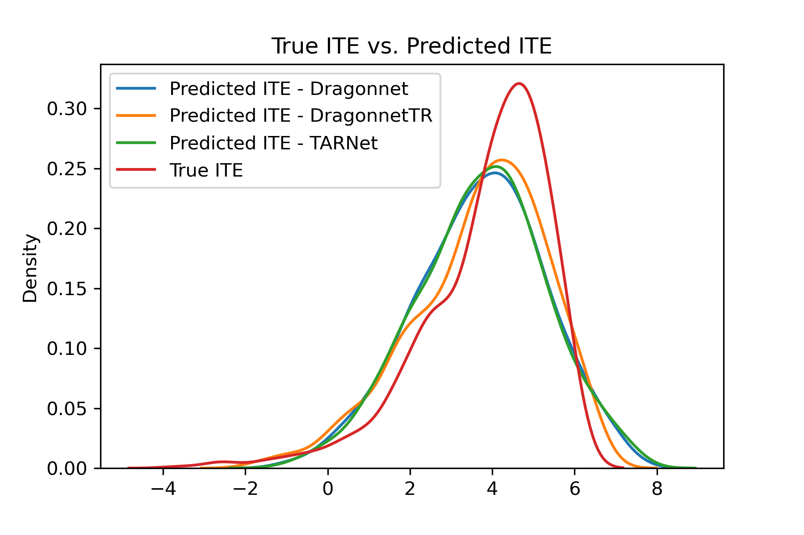
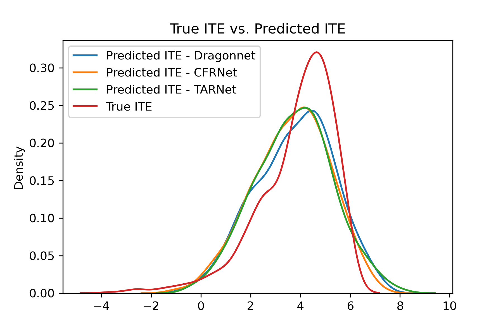

# Final Project --  Deep Learning for Causal Inference

This project implements the TARNet, CFRNet and DragonNet models using Tensorflow with an exploration on ablation studies and fine-tuning on hyperparameters.

## Acknowledgement

This is Tensorflow 2.8.0 implementation of the following models: TARNet, CFRNet and DragonNet based on the following papers:

**1. Estimating individual treatment effect: generalization bounds and algorithms**. **Uri Shalit**, Uri Shalit, Fredrik D. Johansson, David Sontag
  ***PMLR 2017*** [[PDF]](https://proceedings.mlr.press/v70/shalit17a/shalit17a.pdf)

**2. Adapting Neural Networks for the Estimation of Treatment Effects**. [**Claudia Shi**](https://github.com/claudiashi57/dragonnet), David M. Blei, Victor Veitch  ***NIPS 2019*** [[PDF]](https://arxiv.org/pdf/1906.02120.pdf)

**3. Deep Learning of Potential Outcomes**. [**Bernard Koch**](https://github.com/kochbj), Tim Sainburg2, Pablo Geraldo Bastias, Song Jiang, Yizhou Sun, Jacob Foster ***SocArXiv*** [[PDF]](https://arxiv.org/pdf/2110.04442.pdf)

## Dependency
Check the packages needed or simply run the command
Requirements
* tensorflow==2.8.0
* scikit-learn==0.24.2
* numpy==1.21.5
* pandas==1.3.4
* keras-tuner==1.0.4
```console
❱❱❱ pip install -r requirements.txt
```

## Organization of this directory
```bash
.
├── README.md
├── data
│   ├── IHDP
│   │   ├── ihdp_npci_1-100.test.npz
│   │   └── ihdp_npci_1-100.train.npz
│   └── SIPP
│       └── sipp1991.dta
├── main.py
├── model
│   ├── common_layer.py
│   ├── model_loss.py
│   ├── model_metrics.py
│   └── models.py
├── notebook
│   ├── causalDL_hyperparam_opitm.ipynb
│   └── notebook_test.ipynb
├── requirements.txt
├── save
```
## Data
Data is located in folder `./data/IHDP`. 

IHDP dataset is a semi-synthetic dataset based on a randomized experiment of Infant Health and Development Program. A more detailed introduction to this dataset can be found at </br> [`https://www.researchgate.net/publication/11523952_Infant_Mortality_Statistics_from_the_1999_Period_Linked_BirthInfant_Death_Data_Set`](https://www.researchgate.net/publication/11523952_Infant_Mortality_Statistics_from_the_1999_Period_Linked_BirthInfant_Death_Data_Set) </br>
and available for download at </br>
[`http://www.fredjo.com/files/ihdp_npci_1-100.train.npz`](http://www.fredjo.com/files/ihdp_npci_1-100.train.npz) </br>
[`http://www.fredjo.com/files/ihdp_npci_1-100.test.npz`](http://www.fredjo.com/files/ihdp_npci_1-100.test.npz) </br>
## Training&Testing

Example of command: 
TARNet </br>
```console
❱❱❱ python3 main.py --model tarnet --dataset IHDP
```
CFRNet
```console    
❱❱❱ python3 main.py --model cfrnet --dataset IHDP
```
DragonNet (with AIPW)
```console     
❱❱❱ python3 main.py --model dragonnet --dataset IHDP
```
DragonNet (with Targeted Regularization)
```console    
❱❱❱ python3 main.py --model dragonnetTR --dataset IHDP
```
## Code Structure
| File      | Description                                                                   |
|-----------|-------------------------------------------------------------------------------|
|main.py      | model training and testing. 
|data_reader.py                   | read raw data files and convert to required format
|config.py       | configurations and parameters
|models.py  | model classes
|model_metrics.py  | model metrics for evaluation
|common_layer.py                  | utils and layer functions used to construct main models
|model_loss.py                   | loss functions for models
|causalDL_hyperparam_opitm.ipynb | notebook for experimenting fine-tuning
|notebook_test.ipynb | notebook for testing and generating plots

## Plots
* Ablation
<p align="center">

</p>

* ITE
<p align="center">

</p>

* ITE with fine-tuning
<p align="center">

</p>
